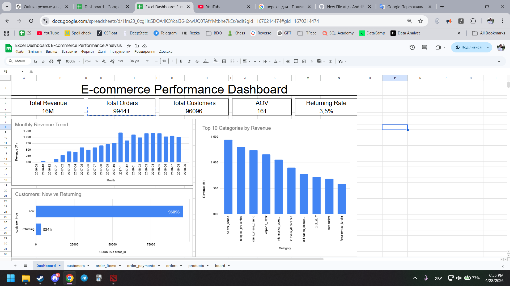

# 🛒 E-commerce Data Analysis (SQL + Excel Project)

## 📌 Overview

This project analyzes a real-world e-commerce dataset to uncover key business insights related to revenue, customer behavior, product performance, and customer satisfaction.

The analysis combines:
- **SQL (PostgreSQL)** for data extraction and transformation
- **Excel (Google Sheets)** for dashboarding and visualization

The goal is to simulate real data analyst tasks and demonstrate strong SQL skills, analytical thinking, and business understanding.

---

## 🎯 Business Questions

- How is revenue changing over time?
- What is the customer retention rate?
- Which product categories generate the most revenue?
- What factors influence customer satisfaction?

---

## 📂 Dataset

Dataset: **Brazilian E-commerce Public Dataset (Olist)**  
Source: https://www.kaggle.com/datasets/olistbr/brazilian-ecommerce

The dataset includes:
- Orders
- Customers
- Products
- Payments
- Reviews

---

## 🧹 Data Preparation (SQL)

- Converted data types (TEXT → numeric, timestamps)
- Created relationships between tables (JOIN logic)
- Cleaned inconsistencies and duplicates
- Fixed revenue calculation using `order_items` (price + freight)

---

## 📊 Dashboard (Excel)

The Excel dashboard includes:

- KPI metrics:
  - Total Revenue
  - Total Orders
  - Total Customers
  - Average Order Value (AOV)
  - Returning Rate

- Visualizations:
  - Monthly Revenue Trend
  - Top 10 Categories by Revenue
  - Customer Segmentation (New vs Returning)

---

## 📈 Analysis

### 💰 Revenue

- Total revenue: **16.0M**
- Strong growth throughout 2017–2018
- Peak month: **November 2017**
- Average order value: **161**

---

### 👤 Customers

- Total customers: **96,096**
- Returning rate: **~3.5%**
- Orders per customer: **1.03**

👉 Most customers make only one purchase → very low retention

---

### 🛒 Products

- Revenue distributed across many categories
- Top categories:
  - Beauty & Health
  - Watches & Gifts
  - Home & Living

👉 Business is diversified and not dependent on a single category

---

### ⭐ Customer Satisfaction

- Average rating: **4.09**

#### Key insights:

- On-time delivery → **4.29 rating**
- Delayed delivery → **2.57 rating**

👉 Delivery delays significantly reduce customer satisfaction

- High-value orders → slightly lower ratings  
👉 Higher expectations from premium customers

- Some sellers consistently receive ratings below 3.0  
👉 Indicates seller performance issues

---

## 🔍 Key Insights

- Customer retention is extremely low (~3.5%)
- Delivery delays are the strongest driver of negative reviews
- Seller performance impacts customer experience
- Revenue is growing but depends on repeat engagement

---

## 💡 Recommendations

- Improve delivery reliability and reduce delays
- Implement customer retention strategies (loyalty programs, remarketing)
- Monitor and improve low-performing sellers
- Focus on top-performing categories for growth

---

## 🛠 Tools Used

- PostgreSQL
- SQL
- Google Sheets / Excel
- pgAdmin

---

## 📂 Project Structure

sql/
├── revenue.sql
├── customers.sql
├── products.sql
├── reviews.sql

Dashboard.xlsx
Dashboard.png
README.md

---

## 📊 Dashboard Preview

---

## 🚀 Author

Aspiring Data Analyst focused on SQL, Excel, and business analytics
